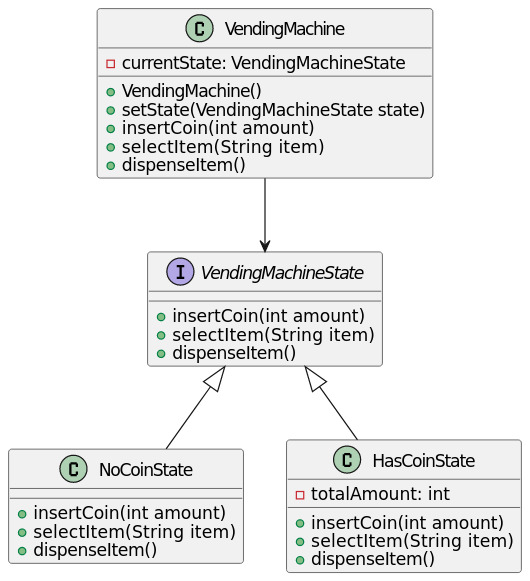

# Description

In this program, I have defined a vending machine with two states: `NoCoinState` and `HasCoinState`. The vending machine starts in the `NoCoinState`, and when a coin is inserted, it transitions to the `HasCoinState`. When an item is selected and the user attempts to dispense an item, the vending machine checks if there is enough money and dispenses the item or asks for more money accordingly. The state transitions are managed through the `VendingMachine` context class.

# Class Diagram
