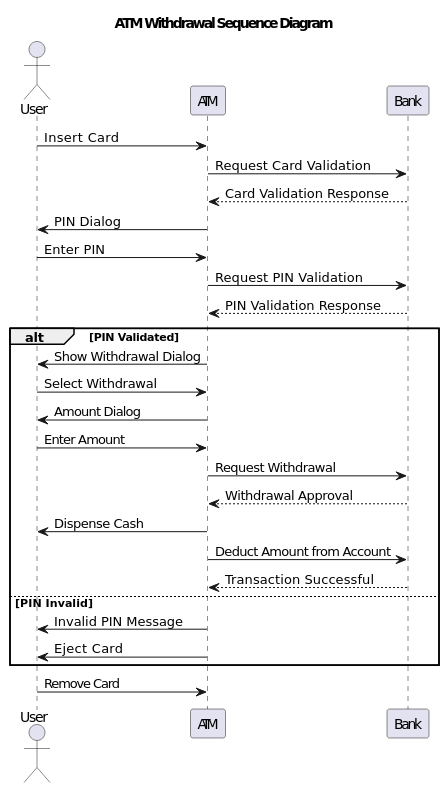

## Introduction

The proposed system is an Automated Teller Machine (ATM) that allows bank customers to perform various financial transactions such as withdrawing cash, checking account balances, and transferring funds between accounts. This ATM system is designed to provide a convenient and secure way for customers to access their bank accounts 24/7.

## UML Sequence Diagram

The UML sequence diagram below illustrates the interaction between the ATM machine, the customer, and the bank's backend systems during a typical withdrawal transaction.

## Operating Process

1. Customer Interaction: The customer starts by inserting their ATM card into the machine.
2. Account Validation: The ATM machine communicates with the bank's backend systems to validate the customer's account. This includes verifying the card's authenticity and checking if the account has sufficient funds.
3. Withdrawal Request: After successful validation, the customer selects the desired withdrawal amount from the available options.
4. Processing Withdrawal: The ATM machine sends a withdrawal request to the bank's backend systems, specifying the amount to be withdrawn.
5. Cash Dispensation: Once the withdrawal is approved by the bank, the ATM dispenses the requested cash to the customer.
6. Transaction Completion: The customer removes their card from the ATM, and the transaction is considered complete.
